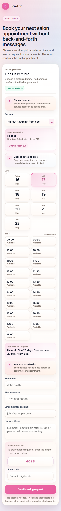
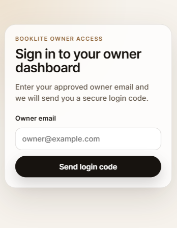
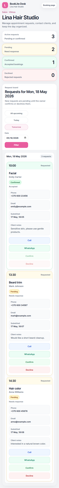
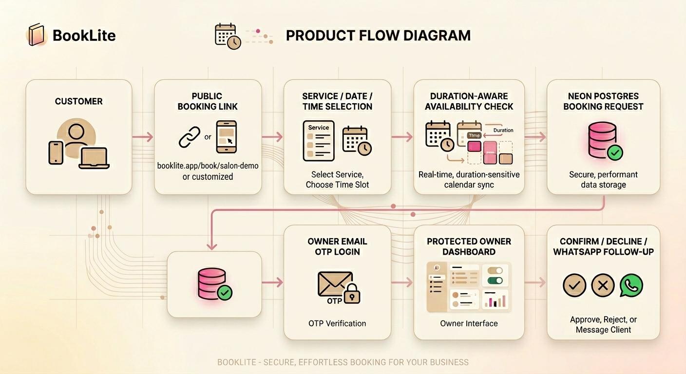

# BookLite

<div align="center">

**A lightweight booking link and owner dashboard for local service businesses.**

BookLite helps salons, barbers, clinics, massage providers, tutors, coaches, and other appointment-based businesses collect booking requests without setting up a heavy booking platform.

<br />


<br />
<br />


</div>

---

## Quick links

| Area | Link |
| --- | --- |
| Customer booking demo | `https://www.booklite.app/book/salon-demo` |
| Owner login demo | `https://www.booklite.app/owner/salon-demo/login` |
| Public demo status | Protected with demo access code |
| Source code | Private |

The public demo is protected with a demo access code to prevent fake/spam bookings.

---

## Preview

### Customer booking page



### Service duration and slot selection


### Owner OTP login



### Protected owner dashboard



---

## What is BookLite?

BookLite gives a small business two simple links:

| Link | Purpose |
| --- | --- |
| Customer booking link | Customers choose a service, date, and preferred time |
| Owner dashboard link | Business owner reviews and manages incoming booking requests |

The product is designed for businesses that are still handling bookings through WhatsApp, Instagram DMs, phone calls, or manual notes.

Instead of forcing a business into a complex scheduling platform from day one, BookLite keeps the first workflow simple:

```txt
Customer booking link → Booking request → Protected owner dashboard → Owner confirmation
```

---

## Why BookLite exists

Many small local businesses do not need a full enterprise booking system.

They usually need something simpler:

- A clean link to share with customers
- Basic service selection
- Service duration support
- A way to avoid overlapping appointment requests
- Customer contact details in one place
- A private owner dashboard
- Manual control before confirming the final appointment

BookLite is built for that middle ground: more professional than WhatsApp-only booking, but simpler than a heavy calendar platform.

---

## Who it is for

| Business type | Example use case |
| --- | --- |
| Hair salons and barbers | Haircuts, beard trims, color treatments |
| Beauty studios | Facials, nails, lashes, skincare |
| Massage providers | 30, 45, 60, and 90-minute sessions |
| Private clinics | Consultations, follow-ups, basic checks |
| Tutors and coaches | Session requests and simple scheduling |
| Local service desks | Appointment or queue-style requests |

---

## Product flow



## Key features

### Customer booking link

- Public booking page per business
- Service selection with duration and price label
- Date and time selection
- Past same-day slots hidden
- Duration-aware overlap prevention
- Simple anti-spam verification code
- Demo access code protection for public demos
- WhatsApp follow-up link after submission

### Duration-aware scheduling

BookLite supports services with different durations.

| Service | Duration |
| --- | ---: |
| Haircut | 30 min |
| Facial | 40 min |
| Hair color | 90 min |
| Massage | 60 min |

Example:

```txt
Existing booking: Facial, 10:00–10:40
New request: Haircut, 10:30–11:00
Result: blocked because it overlaps
```

This prevents the system from treating every service as a fixed 30-minute slot.

### Owner dashboard

- Email OTP login for approved owners
- Protected dashboard using secure session cookies
- Business-specific access protection
- Request board grouped by date
- Booking status management
- Logout flow
- Link back to the customer booking page

### Demo protection

The live demo booking flow is protected with a demo access code.

This prevents random visitors or bots from filling the database with fake bookings while still allowing recruiters, testers, and potential clients to review the product.

---

## How BookLite is different

BookLite is intentionally simpler than large booking platforms.

| Typical booking platforms | BookLite |
| --- | --- |
| Heavy setup and onboarding | Quick booking-link setup |
| Many advanced settings from day one | Focused request workflow |
| Calendar-first experience | Request-first for small businesses |
| Can feel complex for solo businesses | Simple owner dashboard |
| Often self-serve only | Can be customized or managed for each business |
| Automatic confirmation by default | Manual owner confirmation keeps control |

BookLite is useful for businesses that want a professional booking flow but still prefer manual confirmation.

---

## Tech stack

| Layer | Technology |
| --- | --- |
| Frontend | Next.js App Router, React, TypeScript |
| Backend | Next.js API routes |
| Database | Neon Postgres |
| Email | Resend |
| Auth | Email OTP, HTTP-only session cookies |
| Hosting | Vercel |
| Styling | Custom CSS |
| Anti-spam | Honeypot, basic rate limiting, verification code, demo access code |

---

## Security and privacy considerations

Implemented:

- Owner dashboard protected by email OTP
- HTTP-only session cookie
- Server-side session validation
- Business slug authorization check
- Login attempt tracking
- Booking honeypot field
- Basic IP rate limiting
- Public demo access-code protection

Planned:

- Cloudflare Turnstile or CAPTCHA
- Stronger production rate limiting
- Owner/admin audit logs
- Admin controls for demo access codes
- Better abuse monitoring

---

## Current status

BookLite is live as a working MVP.

Implemented:

- Customer booking flow
- Service durations
- Duration-aware overlapping slot prevention
- Database-backed booking requests
- Owner OTP login
- Protected owner dashboard
- Logout
- Demo access-code protection

Planned improvements:

- Mobile and iPad owner dashboard UI improvements
- Owner settings page
- Service editor
- Opening hours editor
- Multi-staff/resource scheduling
- Calendar/timetable display mode
- Admin tools for managing demo businesses
- Optional WhatsApp or Instagram booking automation

---

## Roadmap

| Priority | Improvement |
| --- | --- |
| Near-term | Improve owner dashboard responsiveness on mobile and iPad |
| Near-term | Add admin tools for managing demo businesses and access codes |
| Near-term | Add owner settings for services, durations, prices, and opening hours |
| Mid-term | Add multi-staff or multi-seat scheduling |
| Mid-term | Add full calendar/timetable view |
| Later | Add WhatsApp or Instagram booking automation |
| Later | Add white-label deployment flow for agencies or local providers |

---

## Commercial options

BookLite can be adapted for real businesses, local service providers, or white-label use.

| Option | Description |
| --- | --- |
| Managed business setup | Setup for one local business with custom services, colors, and booking link |
| Monthly hosted plan | Hosted booking page, owner dashboard, basic support, and small updates |
| Custom branding | Tailored booking page and dashboard styling for a specific business |
| White-label version | Adapted version for agencies or local providers |
| Source-code license | Private code licensing available on request |
| Exclusive transfer | Full rights or exclusive transfer available only by separate agreement |

Example starting points:

| Package | Starting point |
| --- | ---: |
| Managed setup | From €99 setup + monthly hosting/support |
| White-label version | From $299 |
| Private source-code license | From $399 |
| Exclusive rights / full transfer | Available on request |

Standard managed setups do not include ownership of the source code. White-label and source-code licensing can be discussed separately.

---

## Contact

For demos, customization, white-label use, or licensing inquiries:

```txt
wadeedmadni09@gmail.com
```

---

## Note

This repository is a public product overview for BookLite.

The production source code, database configuration, environment variables, and deployment configuration are kept private.
